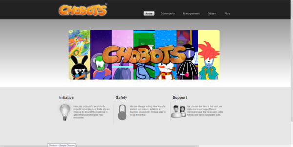
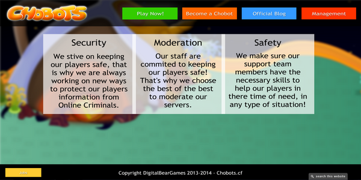
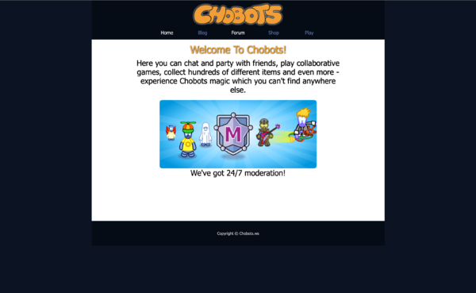
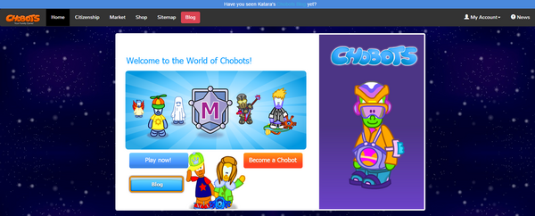
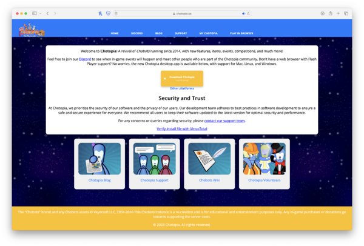

  ⚠️ <strong>This page is out of date and needs to be updated.</strong>

  ✅ <strong>This Server Re-opened on February 5, 2022! A Client is available for download at [https://www.chotopia.us/](https://www.chotopia.us/)</strong>

# Chotopia (Chotopia.us)

  

**Chotopia.us** is a [private server](../privateservers/getting-started.md) which began as *Chobots.cf* in **April 2014**, later transitioning to *Chobots.ws*, and finally settling on **Chotopia**.

## Chotopia Specific Information

- Chotopia Quests
- Chotopia Missions
- [List of Rooms](https://chobots.miraheze.org/wiki/Chobots_Locations#Chotopia.us_Rooms)

---

## The Beginning

Chobots.cf saw a small but steady growth over the first few months of release, reaching **1,000 users** in *August 2014* and **2,000 users** in *January 2015*. It transitioned to *Chobots.ws* around this time and eventually moved to **Chotopia.us**.

---

## Website Homepages & Updates

Many homepage versions existed throughout Chotopia's lifetime. These are archived and will be published after the official blog goes offline.

## 2014

Three revisions were made: one free template, one Flash-based version, and a final one launched in November.

## 2015

A December 2015 blog post revealed the new Chotopia.us design.

## Present

Chotopia.us still uses its 2015 design. Although updates stopped in **January 2021**, the site remains online.

---

## Community

Chotopia has had a Discord, forum, events, and parties. As of now, its Discord has **434 members**.

Chotopia is the **longest living Chobots private server**, likely with the third largest playerbase behind Chobots.net and Chobots.com.

---

## Closed Doors

**Chotopia.us** remained online for majority of 2021 - *however* the blog was last updated in **January 2021** with the following.

> Dear Chotopians,
> 
> It is with sadness that we announce the end of Chotopia. You may be aware that support for Flash is ending on the 12th of January and that means Chotopia will more than likely not be able to run anymore. 
> 
> Chotopia was up for over 6 years, with the entire Chobots history starting in 2008. From then onwards, we made great memories, we laughed, we cried, and overall, we cherished it. We hope that you all continue to cherish the amazing memories you made on Chobots and on Chotopia specifically.
> 
> Chobots, to some, was just a fun game to mess around on, and to others it meant so much. We hope that you look back on these times with a smile and remember all the good times you had playing this wonderful game.
> 
> On behalf of the Chotopia team, farewell. 
> 
> Stay safe, stay healthy, and don’t forget this amazing game.

The server has since come back online and is occasionally updated. [Join the Discord](https://discord.com/invite/fCSyaa2)

---

## Staff

Created by **Shadow**, the original staff included *Brock*, *Cake*, *Curi*, *Evan*, *Smurf*, *Elthomii/E2E2*, and others.

| Name | Username | Position | Tenure |
|------|----------|----------|--------|
| Sorry | Sorry | Administrator | 2014– |
| Shadow | Shadow | Administrator | 2014– |
| Muffin | Muffin | Community Staff | 2014– |
| Novo | Novo | Community Staff | 2014– |
| Brock | imbrock | Developer | 2014–2015 |
| N/A | Curi | Designer | 2014–? |
| N/A | Antonio | Designer | 2019–2020 |
| N/A | Smurf | Designer | 2014–? |
| N/A | Jag | Designer | 2014–? |
| N/A | Elthomii / E2E2 | Moderator | 2014–? |
| N/A | Jaay | Community Staff | ? |
| N/A | Nicole | Designer | 2018– |
| N/A | Bepot | Community Staff | 2018– |
| N/A | Tamara | Community Staff | 2018– |
| N/A | Eistee | Community Staff | 2024 |
| N/A | Brian1king | Community Staff | 2015–2020 |
| N/A | Jacob | Community Staff | 2020– |

